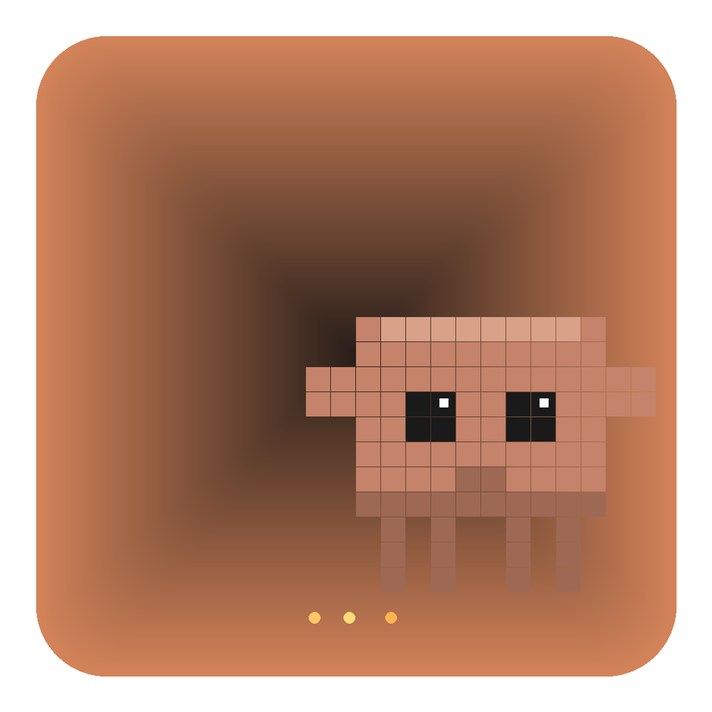

<p align="center">
  
</p>

<h1 align="center">Code Buddy</h1>

<p align="center">
  <strong>Your AI coding companions that live on your macOS desktop</strong>
</p>

<p align="center">
  
  
  
  
</p>

<p align="center">
  <strong>English</strong> | <a href="#code-buddy란">한국어</a>
</p>

---

## What is Code Buddy?

Code Buddy brings adorable pixel-art pets to your macOS desktop. Each pet is an AI-powered coding companion with a specialized role — developer, designer, planner, debugger, reviewer, or tester. They wander around your screen, and you can chat with them to get help with your coding tasks.

### Key Features

- **Desktop Pets** — Cute pixel-art characters that walk, idle, think, and interact on your desktop
- **Multi-AI Support** — Chat with your pets using Claude, OpenAI GPT-4o, Google Gemini, or local Ollama models
- **Specialized Roles** — Each pet has expertise: developer, designer, planner, debugger, reviewer, tester
- **Collaboration Mode** — Gather your pets together and watch them brainstorm as a team
- **Permission System** — Pets jump and glow when Claude CLI needs your approval (click to approve!)
- **File Explorer** — Browse your project files directly in the chat panel
- **Chat Logging** — Collaboration sessions are automatically saved as Markdown files

---

## Screenshots

<table>
<tr>
<td align="center"><strong>Pets on Desktop</strong></td>
<td align="center"><strong>Chat Panel</strong></td>
</tr>
<tr>
<td>Pixel-art pets wander freely on your screen</td>
<td>Chat with any pet via the side panel</td>
</tr>
</table>

---

## Getting Started

### Prerequisites

- **macOS** (Apple Silicon or Intel)
- **Node.js** 18+
- **npm**

### Optional AI Setup

| Provider | Setup |
|----------|-------|
| **Claude** | Install [Claude CLI](https://claude.ai/code) (no API key needed) |
| **OpenAI** | Add your API key in Settings |
| **Gemini** | Add your API key in Settings |
| **Ollama** | Install [Ollama](https://ollama.ai) and pull a model |

### Installation

```bash
# Clone the repo
git clone https://github.com/jamessung644/codebuddy.git
cd codebuddy

# Install dependencies
npm install

# Run the app
npm start
```

### Build

```bash
# Build macOS app
npm run build
# Output: dist/mac-arm64/Code Buddy.app
```

---

## How It Works

### Pet States

| State | Description |
|-------|-------------|
| **Idle** | Standing still, occasional blinking |
| **Walk** | Moving to a random destination with leg animation |
| **Talk** | Mouth animation while showing a chat bubble |
| **Think** | Half-closed eyes, contemplating |
| **Jump** | Bouncing with sparkly eyes — needs your permission approval! |
| **Faint** | Greyed out with X eyes — API quota exhausted (auto-recovers) |

### Architecture

```
Electron Main Process (main.js)
├── AI Providers (Claude CLI / OpenAI / Gemini / Ollama)
├── Config Manager (API keys, preferences)
├── System Tray Menu
└── IPC Handlers
    │
    ├── preload.js (Context Bridge)
    │
    └── Renderer Process
        ├── app.js (UI Controller, Chat, Model Selection)
        ├── pet.js (PixelPet Canvas Renderer + Pet Logic)
        ├── prompts.js (Role-based System Prompts)
        ├── index.html (UI Layout)
        └── style.css (Glassmorphism Dark Theme)
```

### Available AI Models

| Provider | Models |
|----------|--------|
| **Claude** | Default, Sonnet 4.6, Opus 4.6, Haiku 4.5 |
| **OpenAI** | GPT-4o, GPT-4o Mini, o3 |
| **Gemini** | 2.0 Flash, 2.5 Pro |
| **Ollama** | Llama 3, CodeLlama, Mistral |

---

## Collaboration Mode

Click **"Gather"** in the tray menu or control panel to bring all pets together. They'll start a brainstorming session with role-appropriate dialogue:

- Developers discuss architecture and implementation
- Designers talk about UX and layouts
- Planners coordinate timelines and requirements
- ...and more!

Conversations are auto-saved to `Chat/Chat-YYYYMMDD-HHMMSS.md` in your working directory.

---

## Customization

### Pet Colors

8 preset colors available when creating a pet:

| Color | Hex |
|-------|-----|
| Tan/Brown | `#C4836A` |
| Blue | `#6A9EC4` |
| Green | `#8BC46A` |
| Magenta | `#C46AB8` |
| Yellow | `#C4B86A` |
| Cyan | `#6AC4B8` |
| Red | `#C46A6A` |
| Purple | `#8A6AC4` |

### Adding a New Role

1. Add system prompt in `prompts.js`
2. Add role name mappings in `pet.js` (`getRoleName()`, `getRandomGreeting()`, etc.)
3. Add `<option>` in `index.html` modal

### Adding a New AI Provider

1. Add `send{Provider}()` function in `main.js`
2. Add IPC channel in `preload.js`
3. Add dropdown option in `index.html`
4. Update `selectModel()` in `app.js`

---

## Default Pets

| Name | Role | Color |
|------|------|-------|
| Cloudy | Developer | Tan |
| Sonic | Designer | Blue |
| Haiku | Planner | Green |

---

## Tech Stack

- **Electron** 41.1.0 — Desktop app framework
- **HTML5 Canvas** — Pixel art rendering (80x64px, 4px grid)
- **Pure JavaScript** — No frontend framework needed
- **CSS** — Glassmorphism dark theme with animations

---

## Contributing

Contributions are welcome! Here are some ideas:

- [ ] Windows / Linux support
- [ ] More pet animations and states
- [ ] Custom pixel art editor
- [ ] Voice chat integration
- [ ] Plugin system for new AI providers
- [ ] Pet interaction between each other

### Steps

1. Fork this repo
2. Create a feature branch (`git checkout -b feature/amazing-feature`)
3. Commit your changes (`git commit -m 'Add amazing feature'`)
4. Push to the branch (`git push origin feature/amazing-feature`)
5. Open a Pull Request

---

## License

MIT License - see [LICENSE](LICENSE) for details.

---

<p align="center">
  <sub>Built with pixels and love</sub>
</p>

---

<br>

<h1 align="center">Code Buddy</h1>

<p align="center">
  <strong>macOS 데스크톱 위에서 살아 움직이는 AI 코딩 동료들</strong>
</p>

<p align="center">
  <a href="#what-is-code-buddy">English</a> | <strong>한국어</strong>
</p>

---

## Code Buddy란?

Code Buddy는 macOS 데스크톱 위를 돌아다니는 귀여운 픽셀아트 AI 펫 앱입니다. 각 펫은 개발자, 디자이너, 기획자, 디버거, 리뷰어, 테스터 등 전문 역할을 가지며, 채팅을 통해 코딩 작업을 도와줍니다.

### 주요 기능

- **데스크톱 펫** — 화면 위를 걸어다니고, 멈추고, 생각하는 픽셀아트 캐릭터들
- **멀티 AI 지원** — Claude, OpenAI GPT-4o, Google Gemini, 로컬 Ollama 모델로 대화
- **전문 역할** — 개발자, 디자이너, 기획자, 디버거, 리뷰어, 테스터
- **협업 모드** — 펫들을 모아서 팀 브레인스토밍 세션 진행
- **권한 승인** — Claude CLI가 승인이 필요하면 펫이 점프! (클릭해서 승인)
- **파일 탐색기** — 채팅 패널에서 프로젝트 파일 직접 탐색
- **채팅 로그** — 협업 세션을 Markdown 파일로 자동 저장

---

## 시작하기

### 사전 요구사항

- **macOS** (Apple Silicon 또는 Intel)
- **Node.js** 18+
- **npm**

### AI 설정 (선택)

| 제공자 | 설정 방법 |
|--------|-----------|
| **Claude** | [Claude CLI](https://claude.ai/code) 설치 (API 키 불필요) |
| **OpenAI** | 설정에서 API 키 입력 |
| **Gemini** | 설정에서 API 키 입력 |
| **Ollama** | [Ollama](https://ollama.ai) 설치 후 모델 다운로드 |

### 설치

```bash
# 레포 클론
git clone https://github.com/jamessung644/codebuddy.git
cd codebuddy

# 의존성 설치
npm install

# 앱 실행
npm start
```

### 빌드

```bash
# macOS 앱 빌드
npm run build
# 결과: dist/mac-arm64/Code Buddy.app
```

---

## 작동 방식

### 펫 상태

| 상태 | 설명 |
|------|------|
| **대기 (Idle)** | 가만히 서서 가끔 눈 깜빡임 |
| **걷기 (Walk)** | 랜덤 목적지로 이동, 다리 애니메이션 |
| **말하기 (Talk)** | 입 벌림 애니메이션 + 말풍선 표시 |
| **생각 (Think)** | 반쯤 감긴 눈, 고민 중 |
| **점프 (Jump)** | 반짝이는 눈으로 통통 — 권한 승인 필요! |
| **기절 (Faint)** | 회색 + X자 눈 — API 소진 (자동 회복) |

### 아키텍처

```
Electron 메인 프로세스 (main.js)
├── AI 제공자 (Claude CLI / OpenAI / Gemini / Ollama)
├── 설정 관리 (API 키, 환경설정)
├── 시스템 트레이 메뉴
└── IPC 핸들러
    │
    ├── preload.js (Context Bridge)
    │
    └── 렌더러 프로세스
        ├── app.js (UI 컨트롤러, 채팅, 모델 선택)
        ├── pet.js (PixelPet 캔버스 렌더러 + 펫 로직)
        ├── prompts.js (역할별 시스템 프롬프트)
        ├── index.html (UI 레이아웃)
        └── style.css (글래스모피즘 다크 테마)
```

### 지원 AI 모델

| 제공자 | 모델 |
|--------|------|
| **Claude** | 기본, Sonnet 4.6, Opus 4.6, Haiku 4.5 |
| **OpenAI** | GPT-4o, GPT-4o Mini, o3 |
| **Gemini** | 2.0 Flash, 2.5 Pro |
| **Ollama** | Llama 3, CodeLlama, Mistral |

---

## 협업 모드

트레이 메뉴 또는 컨트롤 패널에서 **"모여라"**를 클릭하면 모든 펫이 한곳에 모입니다. 각자 역할에 맞는 대화를 나누며 브레인스토밍을 시작합니다:

- 개발자는 아키텍처와 구현을 논의
- 디자이너는 UX와 레이아웃을 이야기
- 기획자는 일정과 요구사항을 조율
- ...그 외 다양한 역할!

대화 내역은 작업 폴더의 `Chat/Chat-YYYYMMDD-HHMMSS.md`에 자동 저장됩니다.

---

## 커스터마이징

### 펫 색상

펫 생성 시 8가지 프리셋 색상 선택 가능:

| 색상 | Hex |
|------|-----|
| 탄/브라운 | `#C4836A` |
| 블루 | `#6A9EC4` |
| 그린 | `#8BC46A` |
| 마젠타 | `#C46AB8` |
| 옐로우 | `#C4B86A` |
| 시안 | `#6AC4B8` |
| 레드 | `#C46A6A` |
| 퍼플 | `#8A6AC4` |

### 새 역할 추가하기

1. `prompts.js`에 시스템 프롬프트 추가
2. `pet.js`의 `getRoleName()`, `getRandomGreeting()` 등에 역할명 매핑 추가
3. `index.html` 모달에 `<option>` 추가

### 새 AI 제공자 추가하기

1. `main.js`에 `send{Provider}()` 함수 추가
2. `preload.js`에 IPC 채널 추가
3. `index.html`에 드롭다운 옵션 추가
4. `app.js`의 `selectModel()`에 라벨 추가

---

## 기본 펫

| 이름 | 역할 | 색상 |
|------|------|------|
| 클로디 | 개발자 | 탄 |
| 소닉 | 디자이너 | 블루 |
| 하이쿠 | 기획자 | 그린 |

---

## 기술 스택

- **Electron** 41.1.0 — 데스크톱 앱 프레임워크
- **HTML5 Canvas** — 픽셀아트 렌더링 (80x64px, 4px 그리드)
- **순수 JavaScript** — 프론트엔드 프레임워크 없음
- **CSS** — 글래스모피즘 다크 테마 + 애니메이션

---

## 기여하기

기여를 환영합니다! 아이디어 목록:

- [ ] Windows / Linux 지원
- [ ] 더 많은 펫 애니메이션과 상태
- [ ] 커스텀 픽셀아트 에디터
- [ ] 음성 채팅 연동
- [ ] 새 AI 제공자를 위한 플러그인 시스템
- [ ] 펫끼리 상호작용

### 기여 방법

1. 이 레포를 Fork
2. 기능 브랜치 생성 (`git checkout -b feature/amazing-feature`)
3. 변경사항 커밋 (`git commit -m 'Add amazing feature'`)
4. 브랜치에 Push (`git push origin feature/amazing-feature`)
5. Pull Request 열기

---

## 라이선스

MIT 라이선스 - 자세한 내용은 [LICENSE](LICENSE)를 참고하세요.

---

<p align="center">
  <sub>픽셀과 사랑으로 만들었습니다</sub>
</p>
